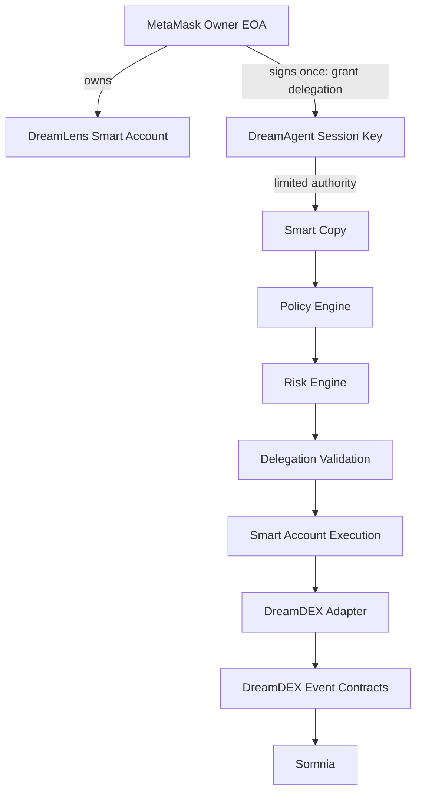
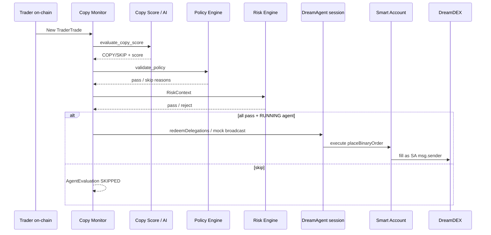

# DreamLens Architecture

DreamLens is an AI-native consumer interface on top of **DreamDEX Event Contracts** on Somnia. DreamDEX remains the execution layer; DreamLens adds discovery, analysis, copy trading, risk controls, and an optional **DreamAgent** with delegated Smart Account authority.

See also: [`SMART_ACCOUNT_INVESTIGATION.md`](SMART_ACCOUNT_INVESTIGATION.md) (Phase 0 go/no-go).

## System overview

## Authority model (hard rules)

- The user's MetaMask account **remains the owner**. DreamAgent is a **delegate**, never the owner.
- AI can recommend `COPY` / `SKIP`. AI **cannot** sign, withdraw, change limits, extend expiry, or alter allowed traders.
- Do **not** use MetaMask Agent Wallet as the deposited trading account.
- Do **not** use Somnia Agent Kit `AgentVault` (agent can withdraw).
- Terminology: **DreamLens Smart Account**, not Agent Vault.

### On-chain vs off-chain

| Layer | Enforces |
| --- | --- |
| **Caveats (ERC-7710)** | Allowed DreamDEX targets/methods, spend/period, expiry — no withdraw/transfer/approve via agent |
| **Policy Engine** | Allowed traders, min copy score, remaining daily/per-trade vs permission |
| **Risk Engine** | Event active, relationship, liquidity, confidence — AI cannot override |

## Request flow (manual trade)

Unchanged for owner-initiated trades:

1. `prepare_trade()` → unsigned tx from DreamDEX adapter  
2. User wallet signs in the browser  
3. `confirm_trade(tx_hash)`

## DreamAgent autonomous flow

No MetaMask popup on the autonomous fill. Grant / revoke still require the owner.

## Agent lifecycle

`CREATED → FUNDED → CONFIGURED → AUTHORIZED → RUNNING` with `PAUSED`, `EXPIRED`, and `REVOKED` (from any state).

## Layer responsibilities

| Layer | Role |
| --- | --- |
| **DreamLens UI** | Lenses, Event Radar, Activate Dream Agent, performance, skip reasons |
| **Django API** | REST + server-rendered views; session auth |
| **SmartAccountService** | create / fund intent / grant / revoke / balance |
| **DreamAgentService** | evaluate → policy → risk → delegated execute |
| **Policy Engine** | Deterministic permission gates (AI cannot mutate) |
| **Risk Engine** | Deterministic safety gates |
| **DreamDEX Adapter** | GraphQL indexer + `placeBinaryOrder` calldata |
| **integrations/metamask** | Environment, caveats, redeem encoding, session broadcast |

## Live Smart Account (runtime)

Runtime is fail-closed on Somnia Shannon. `MOCK_SMART_ACCOUNT=true` is **tests only** (`tests/conftest.py`).

| | Runtime (`MOCK_SMART_ACCOUNT=false`) | Pytest |
| --- | --- | --- |
| Framework | `METAMASK_*` from `scripts/metamask/spike_deploy_and_trade.mjs` | Not required |
| Session key | `DREAM_AGENT_SESSION_KEY` (session EOA only) | Deterministic mock address |
| Execution | `redeemDelegations` on Delegation Manager | Policy/Risk path with test hashes |

Missing `METAMASK_*` or session key returns 503 — the app does not invent Smart Account addresses or fake tx hashes.

## AI never controls permission

AI output is **advisory**. Policy + Risk + on-chain caveats have final say. DreamLens never stores the user's MetaMask private key. The session key (if configured) can only redeem the signed delegation and pays gas; it holds no user collateral.

## Background workers

- `workers.event_sync` — sync markets, radar  
- `workers.copy_monitor` — new `TraderTrade` → copy / DreamAgent path  

## Data model (core)

- `EventContract` / `EventOutcome`  
- `Trade`  
- `TraderProfile` / `TraderTrade`  
- `CopyRelationship` / `CopyExecution`  
- `SmartAccount` / `DreamAgent` / `DreamAgentPermission` / `AgentEvaluation`  
- `EventRadarSignal`  

See [`DREAMDEX_INTEGRATION.md`](DREAMDEX_INTEGRATION.md) for protocol details.
